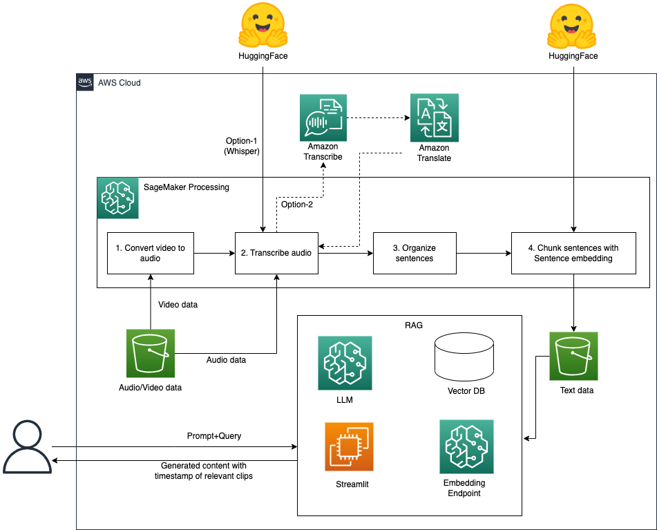

# Implement a RAG solution for Video/Audio data

The existing LLM solution such as RAG or ChatBot only support text data sources. However, video/audio data is also one of the most important knowledge base for organizations holding massive media data. In addition, compared to text data such as documents or books, it's harder to look up information from video/audio data. People may have to go through all video/audio file to localize the information they need. 

In this project, we provide video and audio processing solution for adopting generative AI on video and audio data. There are two main scenarios, 1) Enterprise can enrich their knowledge base with the existing video/audio data, which can make RAG more possible to get relevant information from knowledge base. 2) Individual users can efficiently get the informaiton they are interested in and reach to the most relevant localtion in the video/audio file, which can save much time to look up the information.
 
We demonstrate how to use our outputs in RAG solution with [Question answering using Retrieval Augmented Generation with foundation models in Amazon SageMaker JumpStart](https://aws.amazon.com/blogs/machine-learning/question-answering-using-retrieval-augmented-generation-with-foundation-models-in-amazon-sagemaker-jumpstart/). If you want to try RAG with OpenSearch, you can refer to [Build a powerful question answering bot with Amazon SageMaker, Amazon OpenSearch Service, Streamlit, and LangChain](https://aws.amazon.com/blogs/machine-learning/build-a-powerful-question-answering-bot-with-amazon-sagemaker-amazon-opensearch-service-streamlit-and-langchain/) for modification.

The solution architecture is as below:

<figcaption>Solution Architecture</figcaption></img>

The workflow mainly consists of the following stages:

* Convert video to text with Speech-to-text model and sentence embedding model
* Intelligent video search using Retrieval Augmented Generation (RAG) based approach and LangChain

 
## Convert video to text with Speech-to-text model and sentence embedding model
We use whisper to transcribe video and audio data, and use sentence embedding approach to chunk sentences. You can run [Convert video to text with Speech-to-text model and sentence embedding model](data_preparation.ipynb) for this task.

## Intelligent video search using Retrieval Augmented Generation (RAG) based approach and LangChain
We use our data transcriped from video/audio files to build a RAG solution with LangChain by following the blog Question answering using Retrieval Augmented Generation with foundation models in Amazon SageMaker JumpStart and modifying the source code. You can run [Question Answering based on Custom Video/Audio Dataset with Open-sourced LangChain Library](video_question_answering_langchai.ipynb) for this task.

## Application
We demonstrate a [chatbot](./app_chatbot) application for video and audio data with steamlit.

## Test data
We record [video data](test_raw_data/demo-video-sagemaker-doc.mp4) and [audio data](test_raw_data/test.webm) so that you can use these data to test this solution.

## Security

See [CONTRIBUTING](CONTRIBUTING.md#security-issue-notifications) for more information.

## License

This library is licensed under the MIT-0 License. See the LICENSE file.